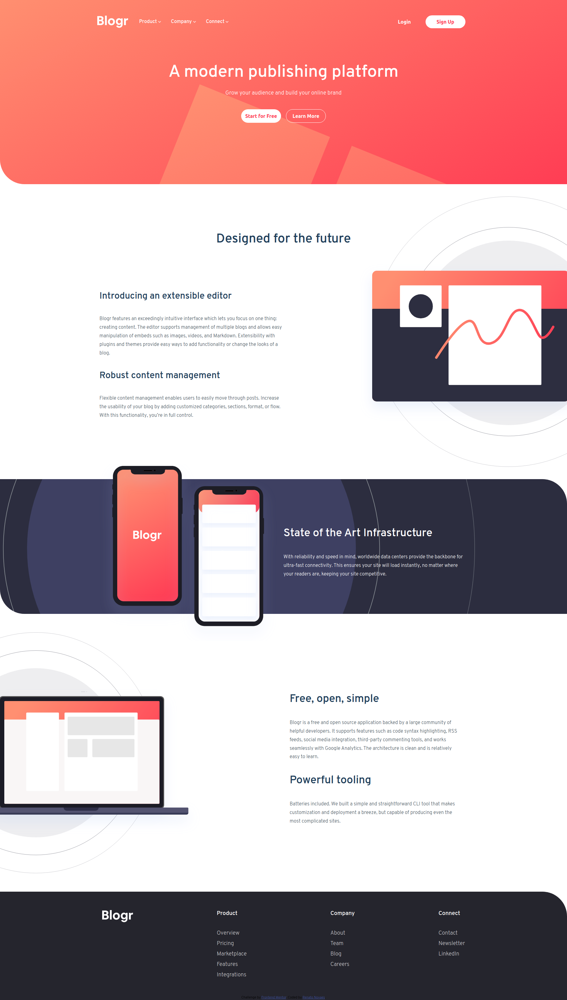
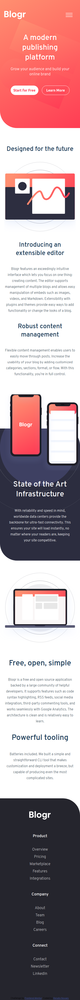

# Frontend Mentor - Blogr landing page solution

This is a solution to the [Blogr landing page challenge on Frontend Mentor](https://www.frontendmentor.io/challenges/blogr-landing-page-EX2RLAApP). Frontend Mentor challenges help you improve your coding skills by building realistic projects. 

## Table of contents

- [Overview](#overview)
  - [The challenge](#the-challenge)
  - [Screenshot](#screenshot)
  - [Links](#links)
- [My process](#my-process)
  - [Built with](#built-with)
  - [What I learned](#what-i-learned)
  - [Continued development](#continued-development)
- [Author](#author)

## Overview

### The challenge

Users should be able to:

- View the optimal layout for the site depending on their device's screen size
- See hover states for all interactive elements on the page

### Screenshot

### Links

- Live Site URL: [Netlify](https://relaxed-brattain-ee9604.netlify.app/)

## My process

### Built with

- Semantic HTML5 markup
- CSS custom properties
- Flexbox
- Mobile-first workflow

### What I learned

The HTML Semantic, even starting from a mobile desing, must be planned with careful. I had to change de semantic when I started to develop for a desktop version.

### Continued development

The hover effect on the menu for the desktop version doesn't work and the mobile menu too. Maybe I should split the CSS file in several others, to simplify and have a better organization.

## Author

- Website - [Renato Novaes](https://www.renatonovaes.dev)
- Linkedin - [renatonovaes49](https://www.linkedin.com/in/renatonovaes49)